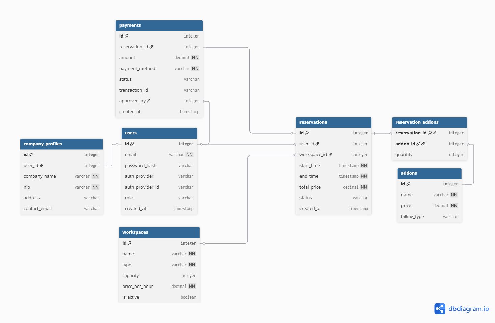

# SpaceSync
SpaceSync - aplikacja do zarządzania przestrzenią biurową

# Backend
Uruchomienie backendu:

# Windows
```bash
cd backend
.\mvnw.cmd spring-boot:run
```

# Linux/MacOS
```bash
cd backend
./mvnw spring-boot:run
```

# Frontend
Uruchomienie frontendu:

```bash
cd frontend
npm install
npm run dev
```

# Schemat ERD bazy danych


# Diagram przypadków użycia

